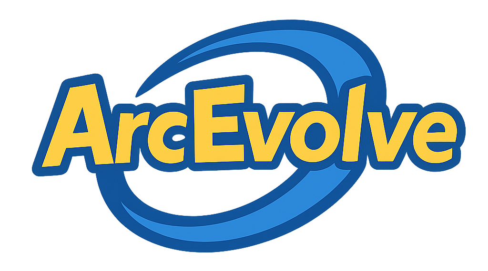
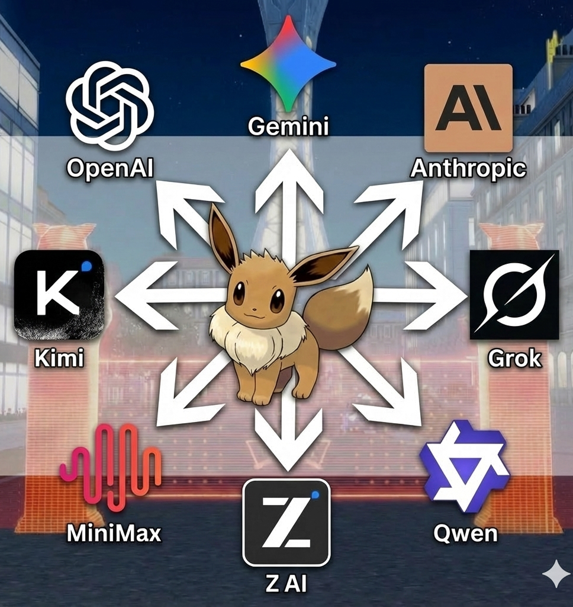
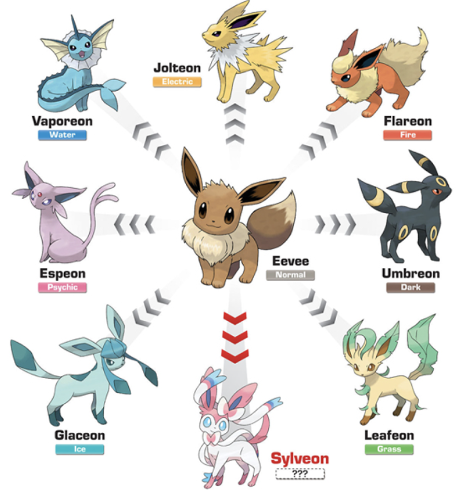

<table>
<tr>
<td></td>
<td></td>
</tr>
</table>

 

# 🇨🇳 EEVEE - ARC-AGI-1 (中文)

用于解决 ARC-AGI-1 问题的进化大规模突变。

### 岛屿配置

| 岛屿 | 第 1-4 轮    | 第 5-12 轮   |
| ---- | ------------ | ------------ |
| 1    | Gemini 3 Pro | Gemini 3 Pro |
| 2    | Gemini 3 Pro | Gemini 3 Pro |
| 3    | Gemini 3 Pro | Gemini 3 Pro |
| 4    | Claude 4.5   | Gemini 3 Pro |
| 5    | Claude 4.5   | Gemini 3 Pro |

### 第 0 轮：视觉先验分类器

Claude 基于官方训练数据集、ConceptARC 和 ARC-GEN-100K 构建了视觉先验

| 步骤 | 模型       | 用途         |
| ---- | ---------- | ------------ |
| 0    | Claude 4.5 | 分类视觉先验 |

### 大规模突变

| 轮次 | 模型                    | 并行调用 |
| ---- | ----------------------- | -------- |
| 1    | Grok 4.1 Fast Reasoning | 100      |
| 2    | Gemini 3 Pro            | 1        |
| 3    | Grok 4.1 Fast Reasoning | 100      |
| 4    | Claude 4.5 Opus         | 1        |
| 5    | Grok 4.1 Fast Reasoning | 100      |

### 依赖项

1. **Railway.com 服务器** - 托管测试问题
2. **API 密钥**：
   - Gemini 3 Pro
   - Claude 4.5 Opus
   - Grok 4.1 Fast Reasoning

### 复现步骤

1. 在 EVAL 中运行 runner.sh 启动流程。可以通过 logs.txt 查看进度

2. 请将问题放在单独的服务器上，该服务器只能通过 API 访问以 1) 获取问题 2) 提交答案。这有助于保持完整性并防止数据污染

3. 本项目使用 GCP、Azure 和 Grok 直接 API 访问构建。

 

▰▰▰▰▰▰▰▰▰▰▰▰▰▰▰▰▰▰▰▰▰▰▰▰▰▰▰▰▰▰

 

# 🇰🇷 EEVEE - ARC-AGI-1 (한국어)

ARC-AGI-1 문제 해결을 위한 진화적 대량 돌연변이.

### 아일랜드 구성

| 아일랜드 | 라운드 1-4   | 라운드 5-12  |
| -------- | ------------ | ------------ |
| 1        | Gemini 3 Pro | Gemini 3 Pro |
| 2        | Gemini 3 Pro | Gemini 3 Pro |
| 3        | Gemini 3 Pro | Gemini 3 Pro |
| 4        | Claude 4.5   | Gemini 3 Pro |
| 5        | Claude 4.5   | Gemini 3 Pro |

### 라운드 0: 시각적 사전 분류기

Claude가 공식 훈련 데이터셋, ConceptARC 및 ARC-GEN-100K를 통해 사전을 구축했습니다

| 단계 | 모델       | 목적             |
| ---- | ---------- | ---------------- |
| 0    | Claude 4.5 | 시각적 사전 분류 |

### 대량 돌연변이

| 라운드 | 모델                    | 병렬 호출 |
| ------ | ----------------------- | --------- |
| 1      | Grok 4.1 Fast Reasoning | 100       |
| 2      | Gemini 3 Pro            | 1         |
| 3      | Grok 4.1 Fast Reasoning | 100       |
| 4      | Claude 4.5 Opus         | 1         |
| 5      | Grok 4.1 Fast Reasoning | 100       |

### 의존성

1. **Railway.com 서버** - 테스트 질문 호스팅
2. **API 키**:
   - Gemini 3 Pro
   - Claude 4.5 Opus
   - Grok 4.1 Fast Reasoning

### 재현 방법

1. EVAL 폴더에서 `runner.sh`를 실행하여 프로세스를 시작합니다. `logs.txt`를 통해 진행 상황을 모니터링할 수 있습니다.

2. 질문을 별도의 서버에 호스팅하되, API 엔드포인트를 통해서만 접근 가능하도록 합니다: 1) 질문 가져오기 2) 답변 제출. 이를 통해 무결성을 유지하고 데이터 오염을 방지합니다.

3. GCP, Azure 및 Grok 직접 API 액세스를 사용하여 구축되었습니다.

 

▰▰▰▰▰▰▰▰▰▰▰▰▰▰▰▰▰▰▰▰▰▰▰▰▰▰▰▰▰▰

 

# 🇺🇸 EEVEE - ARC-AGI-1 (English)

Evolutionary Mass Mutation for solving ARC-AGI-1 problems.

### Island Configuration

| Island | Rounds 1-4   | Rounds 5-12  |
| ------ | ------------ | ------------ |
| 1      | Gemini 3 Pro | Gemini 3 Pro |
| 2      | Gemini 3 Pro | Gemini 3 Pro |
| 3      | Gemini 3 Pro | Gemini 3 Pro |
| 4      | Claude 4.5   | Gemini 3 Pro |
| 5      | Claude 4.5   | Gemini 3 Pro |

### Round 0: Visual Prior Classifier

Claude built the priors via the Official Training Dataset, ConceptARC, & ARC-GEN-100K

| Step | Model      | Purpose                |
| ---- | ---------- | ---------------------- |
| 0    | Claude 4.5 | Classify visual priors |

### Mass Mutation

| Round | Model                   | Parallel Calls |
| ----- | ----------------------- | -------------- |
| 1     | Grok 4.1 Fast Reasoning | 100            |
| 2     | Gemini 3 Pro            | 1              |
| 3     | Grok 4.1 Fast Reasoning | 100            |
| 4     | Claude 4.5 Opus         | 1              |
| 5     | Grok 4.1 Fast Reasoning | 100            |

### Dependencies

1. **Railway.com server** - hosts the test questions
2. **API Keys**:
   - Gemini 3 Pro
   - Claude 4.5 Opus
   - Grok 4.1 Fast Reasoning

### To Reproduce

1. Run `runner.sh` in the `EVAL` folder to start the process. Monitor progress via `logs.txt`.

2. Host the questions on a separate server accessible only via API endpoints to: 1) fetch questions and 2) submit answers. This maintains integrity and prevents data contamination.

3. Built using GCP, Azure, and Grok Direct API Access.

 

▰▰▰▰▰▰▰▰▰▰▰▰▰▰▰▰▰▰▰▰▰▰▰▰▰▰▰▰▰▰

 

### Citation

If you use this code or these results in your research, please cite:

> Colin Snyder (2025). ArcEvolve.

 

<i>Results may vary between runs. This system relies on multiple probabilistic components—LLM inference, evolutionary mutation, and stochastic sampling—each introducing natural variance into the solution space.</i>

<i>We made modifications to the codebase to increase readability. Please let us know if this introduced any bugs.</i>

